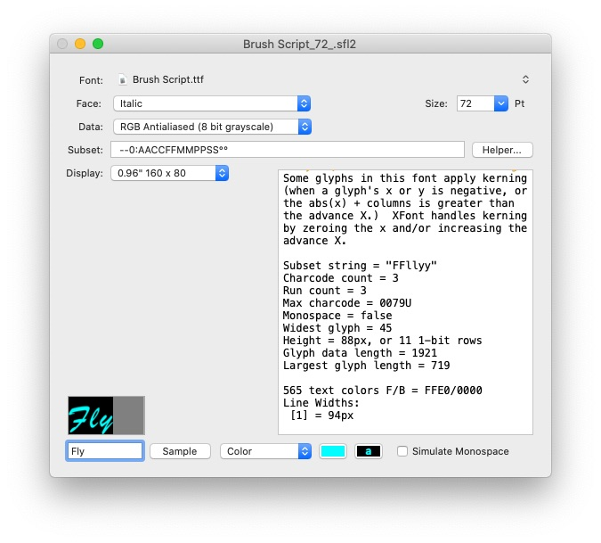

# SubsetFontCreator

SubsetFontCreator is an Objective-C OS X app that creates a subset of a font for use on displays such as Color TFT, Monochrome OLED and LCDs controlled by many of the MCUs supported by the Arduino IDE.

In many cases you only need a subset of the characters within a font.  For example, if you're writing a thermometer sketch you probably only need the characters needed to display the temperature.

The source fonts are whatever ttf and otf fonts that are present on your Mac.

<i>Disclaimer: It's assumed you have read the End User License Agreement (EULA) of any font you choose to render on your display regarding the permissibility of storing the bitmapped font on the target device. SubsetFontCreator creates bitmapped subfonts, and according to [The Law on Fonts and Typefaces](https://www.crowdspring.com/blog/font-law-licensing/), bitmapped fonts are not copyright protected, but the act of creating the bitmap may be protected.</i>

<b>Portions of this software are copyright © 2018 The [FreeType](https://www.freetype.org) Project.  All rights reserved.</b>

# Usage
Launch the application, select a font, encoding options and define the subset range string.  Use the Help menu to display instructions for creating the subset range string.  If you use a particular font often, you can save the font and its settings via shift-⌘-s.  These saved sets show up in the recents menu.

SubsetFontCreator has two export formats, binary and C header.  The binary format is useful if you plan on storing the font on an EEPROM or SD Card.  The C header format is generally used when you intend to store the font in the MCU's flash memory.  In addition, both formats have the option of exporting the glyph data as a separate binary file.  The separate binary option might be used to store the glyph data on an EEPROM with the font header and lookup tables in the MCU's flash memory.  When this option is selected, the associated C header or binary does not contain the glyph data.  This option is found on the export save panel.

All of the other export options are selected in the application's main window.  These options are:
* Font - any ttf or otf font supported by FreeType
* Supplemental - font used when the main font doesn't contain the desired glyph.
* Font size - the font size in points.
* Glyph data format - RGB antialiased, 1 bit, 1 bit rotated with either horizontal or vertical addressing.
* Subset string - a UTF-8 string that defines the set of glyphs to export.   
* 16 or 32 bit glyph data offsets.  The option to export 32 bit offsets is no longer exposed in the GUI because XFont only supports 16 bit offsets.

Press "Helper…" to display the subset string helper window.  This window allows you to create the subset string by typing or pasting text containing the characters you plan to use into the helper window's text field.

In addition to the primary feature of exporting bitmapped subset fonts, there is a sample feature for viewing sample text with the defined options at the same physical size for various common displays.  Note that all settings below the subset string edit field have no impact on what gets exported, they're only used to define the sample.

Additional sample displays may be added by editing the ArduinoDisplays property list in the application bundle.  This property list defines the screen dimensions in pixels as well as the size of the active area in millimeters.  By combining this information with the Mac's own display information it's possible to display an accurately scaled sample.

An unscaled sample:

A scaled sample 8 bit on a TFT high res display:

A scaled sample, 1 bit on a low res display:

You can change the sample foreground and background colors.  Color can be applied to any display sample regardless of whether the target device supports color.

A scaled sample on a 1 bit OLED display:

The same classes used to create the sample are used in the Arduino sketches.  This will give you a reasonable idea of what the sample will look like on your device.  Using the actual classes in the SubsetFontCreator also makes it easier to debug the non-device specific code using Xcode's debugger.

# Glyph Drawing
The primary class is XFont.  All of the other classes are used in combination based on the font storage and the display device being targeted.  As noted earlier, subset fonts can be exported in multiple ways depending on where the font data will be stored.

The data storage is abstracted by the use of data streams.  The DataStream base class is pure virtual.  Subclasses allow the data to be read from SRAM, program memory, or on any device for which a subclass of DataStream has been written.  The generic data stream classes are used indirectly by the XFont specific streams, XFontR1BitDataStream, XFontRH1BitDataStream and XFont16BitDataStream.  When you choose the export format "C++ Header" without the separate data option, SubsetFontCreator has enough information to generate the C++ code needed to implement the font.  You'll see this auto-generated code at the end of the exported header file.  The comments around this code contain basic usage instructions.  In most cases instantiating a display and connecting it to a font are all that remains to be done.

Like the DataStream classes, all of the display classes are subclassed from a common DisplayController class.  Currently there are classes for the TFT ST777xx family, LCD ST7567, OLED SSD1306, and Nokia PCD8544 controllers.  I have a limited number of samples of each.  As you may know the ST777xx family covers quite a few variants so some tweaking may be required.

All drawing is done by calling xFont->DrawStr().  DrawStr is passed a UTF-8 string.  You need to call display->MoveTo() or xFont->MoveTo() prior to calling DrawStr.  DrawStr can optionally simulate a monospace font by passing it the width of the widest glyph in the string being drawn.  This is generally useful for displaying number fields for fonts that aren't natively monospace.  XFont has a WidestGlyph function that can be used to calculate the monospace width.  You can also get this number from within SubsetFontCreator by displaying a sample containing the glyphs to be drawn.  A monospace entry in the SubsetFontCreator info view will note when a subset is monospace.  In some fonts numbers are monospace even though the entire font isn't (e.g. MyriadPro.)

XFont allows you to set the text foreground and background colors as well as highlight foreground and background colors.  XFont->EnableHighlighting() is implemented by swapping out the text colors with the highlight colors.

# Arduino
Under the Arduino folder in the repository are the classes described above and a few simple examples.  Contact me if you have questions about implementation.

# Glyph Data Storage
1 bit data is stored by removing all bit padding and shifting the bits into a contiguous string of bits.  FreeType generates bitmap data that is the exact size of the glyph plus padding (e.g for a 6 bit wide glyph there will be 2 bits of padding per row.)  The XFont storage requirements for any glyph are its row and column dimensions rounded up to the nearest byte.  For example, if the glyph dimensions are 6 rows x 6 columns, the number of bytes needed to store it would be abs(((6 * 6) + 7)/8) or 5 bytes.

8 bit data is stored using simple run length encoding.  For each run the data starts with a signed length byte.  If the length byte is positive the next byte should be repeated length times.  If the length byte is negative, -length bytes of unique data should be copied.  This optimizes the case where there are runs of unique values.

XFontR1BitDataStream, XFontRH1BitDataStream and XFont16BitDataStream are used to unpack the glyph data.  XFontR1BitDataStream and XFontRH1BitDataStream work on rotated 1 bit data as used on monochrome displays such as the OLED SSD1306 and Nokia PCD8544 controllers.

The 'H' in XFontRH1BitDataStream refers to horizontal addressing.  Either horizontal or vertical addressing can be used by any of the 1 bit controllers but it is recommended to use horizontal with the ST7567 controller because it doesn't natively support vertical addressing. When vertically formatted font data is used with the ST7567, each data byte requires 3 additional command bytes in order to set the page and column for the next data byte.

XFont16BitDataStream unpacks both 1 bit unrotated and 8 bit data for use with 16 bit RGB displays.  For 8 bit data the XFont16BitDataStream handles blending the foreground and background colors to implement antialiasing.  Obviously antialiasing should only be used when the resolution of the display is high enough, otherwise 1 bit makes more sense.

If you plan on supporting many fonts in your project, more than the available flash program space available, the glyph data can be stored anywhere.  As a test I wrote a data stream for the AT24Cxxx family of eeproms (included in the Arduino examples.)  The drawing speed is slightly slower, but it works fine otherwise.

To get font data or any other data onto various storage devices, I wrote an application to do the conversion to Intel HEX format and serially transfer the data to the target device.  See [SerialHexLoader](https://github.com/JonMackey/SerialHexLoader) for more details.

# Building
The app can be built as a sandboxed app or a regular app.  Only the sandboxed app has been tested.  A built sandboxed app is included in the repository.  A built archive of the FreeType library is included in the repository.  If for some reason you need to build the FreeType archive, the FreeType project without the sources is included in the repository.    You can get the FreeType sources from [FreeType](https://download.savannah.gnu.org/releases/freetype/) org, version 2.9.1.  Before building the FreeType archive you should comment out the two zip related defines: FT_CONFIG_OPTION_USE_LZW and FT_CONFIG_OPTION_USE_ZLIB in ftoption.h otherwise you may get missing symbol errors when you try to build the release version of SubsetFontCreator.  The built libfreetype archive needs to be copied to the Library folder within the root SubsetFontCreator folder.

Note that SubsetFontCreator calls a C++ class of the same name.  All file creation happens in this class using std C++.  This class could be used as the basis for an app on another OS with minor tweaking (it uses POSIX paths.)  FreeType is already cross platform.

